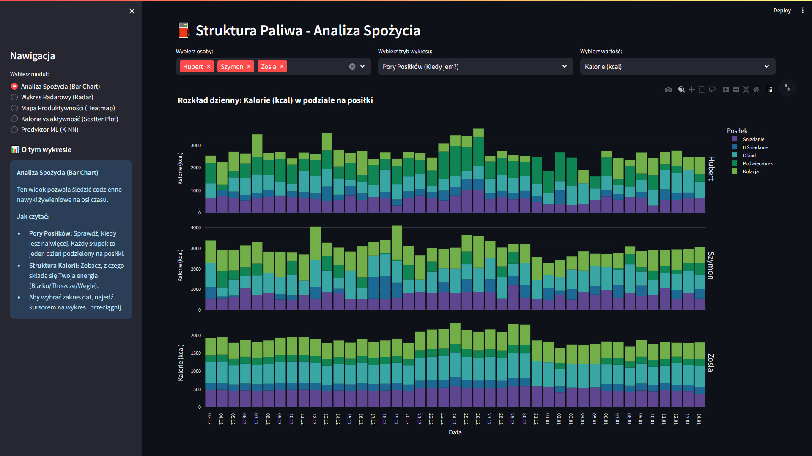
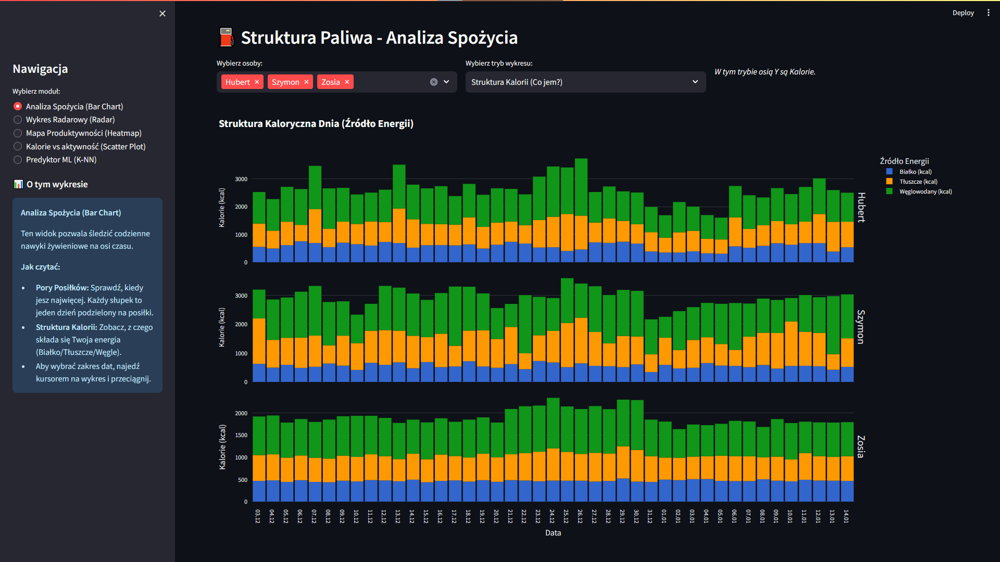
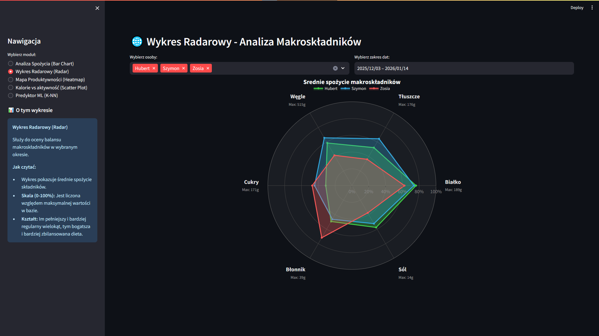
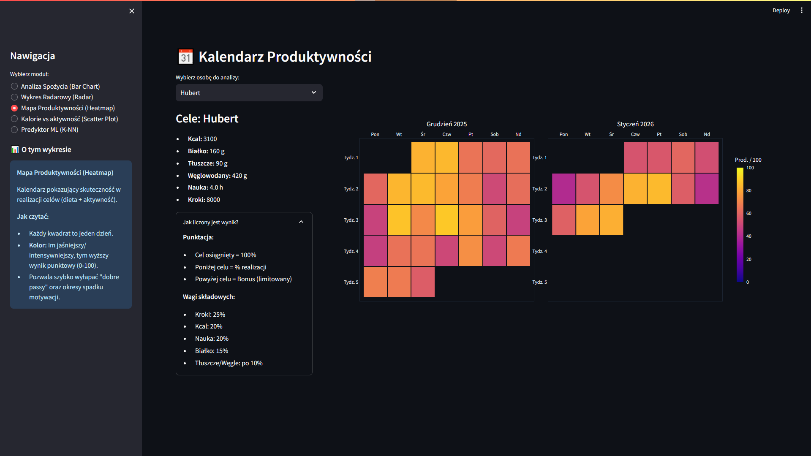
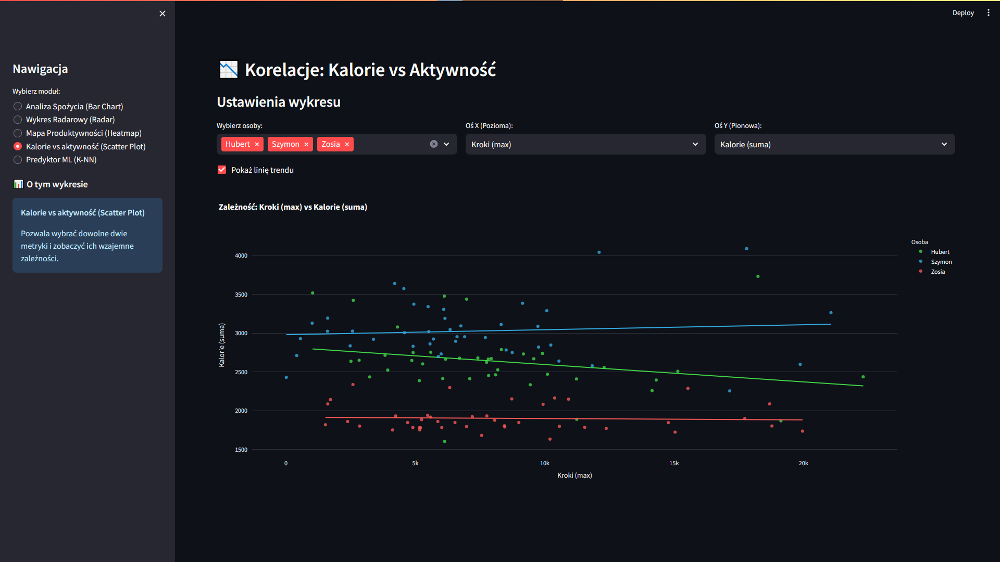
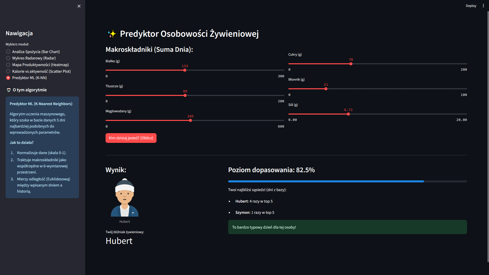

# Projekt JA - Interaktywny Dashboard Żywieniowy
**Autorzy:** Hubert Zalewski, Szymon Domański, Zofia Tarłowska  
**Technologie:** Python, Streamlit, Plotly, Uczenie Maszynowe (KNN)

##  Opis projektu
Nasz projekt to interaktywne narzędzie służące do analizy i wizualizacji danych dotyczących stylu życia, odżywiania oraz produktywności członków naszego zespołu. Przez półtora miesiąca zbieraliśmy szczegółowe dane na temat spożywanych posiłków, aktywności fizycznej oraz czasu poświęconego na naukę.

Aplikacja pozwala na odkrycie korelacji między stylem odżywiania a efektywnością dnia, porównanie nawyków między osobami w grupie oraz wykorzystuje algorytmy uczenia maszynowego do personalizacji danych.

## 🚀 Moduły aplikacji

Aplikacja składa się z pięciu paneli analitycznych:

1.  **⛽ Struktura Paliwa (Stacked Bar Chart)** Analiza rozkładu kalorii i makroskładników w podziale na konkretne posiłki (Śniadanie, Obiad, itd.). Pozwala sprawdzić, która część dnia jest u nas najbardziej energetyczna.

2.  **🌐 Profil Makroskładników (Radar Chart)** Wykres radarowy porównujący średnie spożycie (białko, tłuszcze, węgle, cukry, błonnik, sól) między członkami zespołu. Idealny do wizualizacji różnic w dietach.

3.  **📉 Korelacje: Kalorie vs Aktywność (Scatter Plot)** Moduł badający zależności między różnymi zmiennymi. Pozwala sprawdzić np. czy większa liczba kroków wiąże się u nas z większym apetytem (kaloriami) lub czy podaż cukrów wpływa na godziny poświęcone na naukę.

4.  **📅 Kalendarz Produktywności** Algorytm waży realizację celów dziennych (kroki, kcal, nauka, białko) i wizualizuje produkywność użytkownika na przestrzeni miesięcy w formie interaktywnego kalendarza.

5.  **🤖 Twój Bliźniak Żywieniowy (ML Prediction)** Moduł wykorzystujący algorytm **K-Nearest Neighbors (KNN)**. Na podstawie wprowadzonych przez użytkownika parametrów dzisiejszego jadłospisu, system przeszukuje naszą bazę i znajduje historyczny dzień jednego z nas, który był najbardziej zbliżony pod kątem profilu odżywczego.

