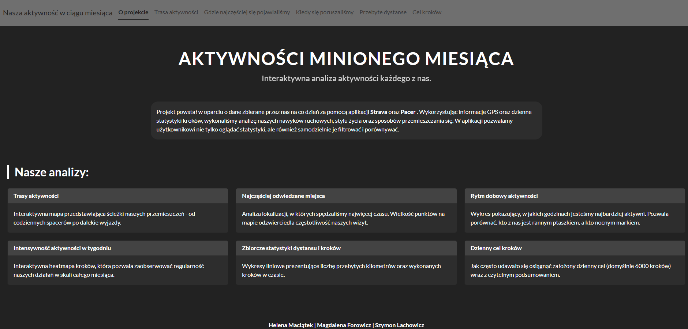

# Aktywności Minionego Miesiąca – Interaktywna Analiza Ruchu

Interaktywna aplikacja służąca do wizualizacji i analizy danych o naszej aktywności fizycznej oraz nawykach transportowych zebranych na przełomie 2025 i 2026 roku.

## O Projekcie
Projekt powstał w oparciu o dane zbierane przez nas na co dzień za pomocą aplikacji **Strava** oraz **Pacer**. Wykorzystując informacje GPS oraz dzienne statystyki kroków, wykonaliśmy analizę naszych nawyków ruchowych, stylu życia oraz sposobów przemieszczania się. W aplikacji pozwalamy użytkownikowi nie tylko oglądać statystyki, ale również samodzielnie je filtrować i porównywać.

---

## Analizy

Aplikacja oferuje sześć głównych perspektyw badawczych:

* **Trasy aktywności** – Interaktywna mapa przedstawiająca ścieżki naszych przemieszczeń – od codziennych spacerów po dalekie wyjazdy (np. do Włoch czy Norwegii).
* **Najczęściej odwiedzane miejsca** – Analiza lokalizacji, w których spędzaliśmy najwięcej czasu. Wielkość punktów na mapie odzwierciedla częstotliwość wizyt w punktach takich jak Gmach Główny PW, Wydział MiNI czy domy prywatne.
* **Rytm dobowy aktywności** – Wykresy prezentujące, w jakich godzinach jesteśmy najbardziej aktywni. Pozwala to określić, kto z nas jest rannym ptaszkiem, a kto preferuje wieczorne spacery.
* **Intensywność aktywności w tygodniu** – Interaktywna heatmapa kroków, która pozwala zaobserwować regularność naszych działań w skali całego miesiąca.
* **Zbiorcze statystyki dystansu i kroków** – Wykresy liniowe prezentujące sumaryczną liczbę przebytych kilometrów oraz wykonanych kroków w czasie.
* **Dzienny cel kroków** – Monitoring realizacji założonego celu (domyślnie 6000 kroków) wraz z czytelnym podsumowaniem procentowym dla każdego użytkownika.

---

## Autorzy
Projekt został przygotowany przez zespół w składzie:
* **Helena Maciątek**
* **Magdalena Forowicz**
* **Szymon Lachowicz**

---
