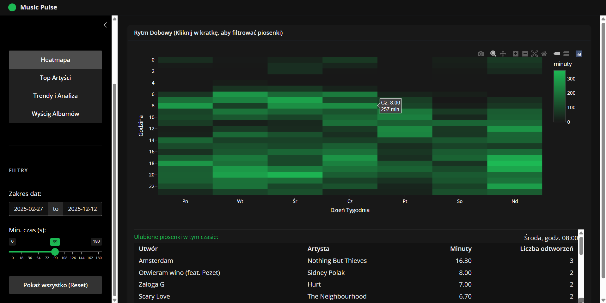
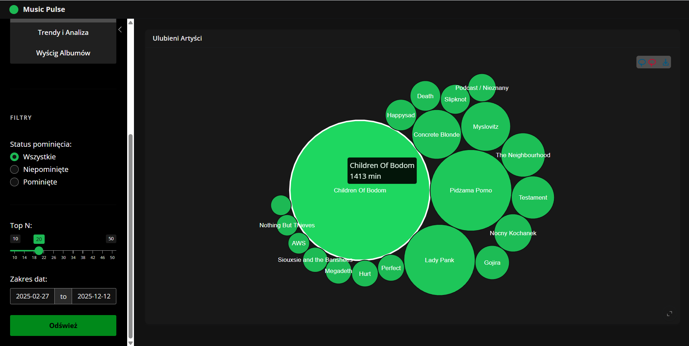
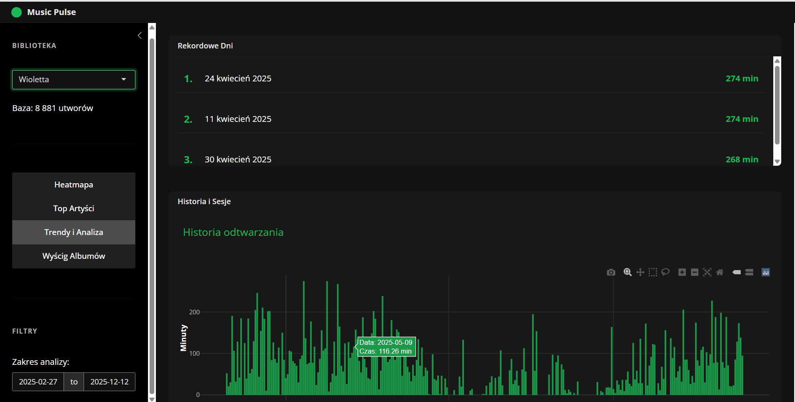
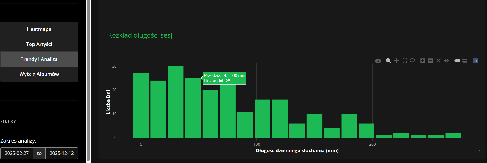
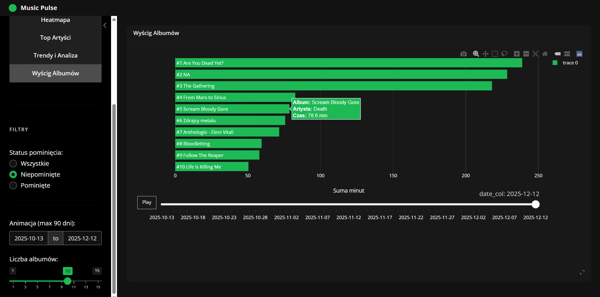

# Music Pulse

Projekt został stworzony w Shiny.

## Dane

Dane pochodzą ze Spotify. Jest możliwość wyboru analizy danych dla jednej z trzech osób tworzących projekt.

## Heatmapa

W pierwszej zakładce jest wykres pokazujący w jakich porach dnia najczęściej słuchano muzyki, a pod nim wyświetla się lista ulubionych piosenek w tym czasie wraz z informacją o liczbie odtworzeń, przesłuchanych minutach i artyście.

Badany jest zakres czasu dany przez użytkownika. Po kliknięciu na dany kafelek na wykresie, pod nim aktualizowana jest tabela na ulubione piosenki słuchanych w tym czasie. Możliwe jest odznaczenie kafelka, tak by tabela znowu pokazywała szerszy okres czasu poprzez naciśnięcie guzika.

## Top artyści

Oprócz zakresu dat, możliwy jest wybór liczby ulubionych artystów, oraz filtrowanie liczonych danych ze względu na to czy utwory zostały pominięte w trakcie słuchania czy nie. Ranking jest ustalany poprzez sumowanie minut spędzonych na słuchaniu danego artysty. Po kliknięciu guzika ukazują się bąbelki z nazwami artystów, a po najechaniu na nie widać liczbę spędzonych minut.

## Trendy i analiza

Możliwe jest wybranie zakresu dat. Na tej stronie wyświetlają się trzy dni, w których słuchano najwięcej muzyki w badanym zakresie. Pod nim jest wykres słupkowy przedstawiający liczbę przesłuchanych minut w podziale na dni w zakresie.

Kolejny wykres przedstawia rozkład długości sesji, czyli ile odbyło się sesji słuchania o danej długości. Wykresy są interaktywne.

## Wyścig albumów

Istnieje możliwość wybrania zakresu dat, jest on ograniczony do 90 dni w celu optymalizacji czasu trwania aplikacji. Wybierane są także liczba albumów i status pominięcia uwzględnianych w obliczeniach piosenek.

Na podstawie cumsuma można śledzić zmiany w ulubionych albumach w tym okresie, słupki są posortowane, więc jak jeden urośnie nad drugi to się wymijają. Można suwakiem ustawić konkretną datę, a po najechaniu na słupek wyświetlana jest inf. o m.in. artyście.
