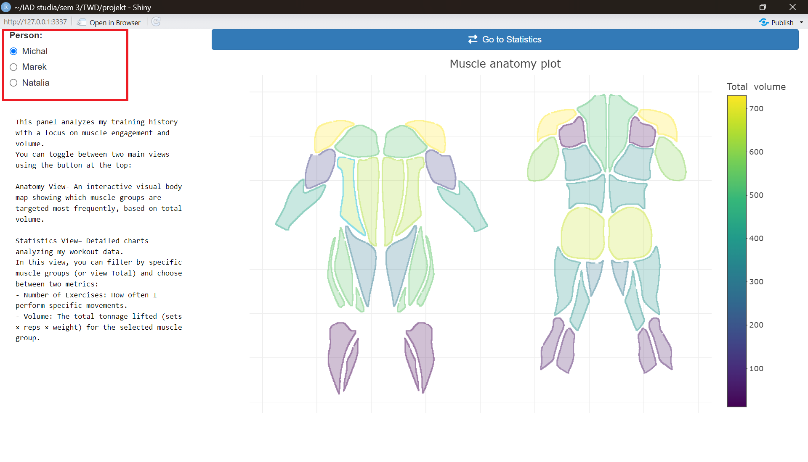
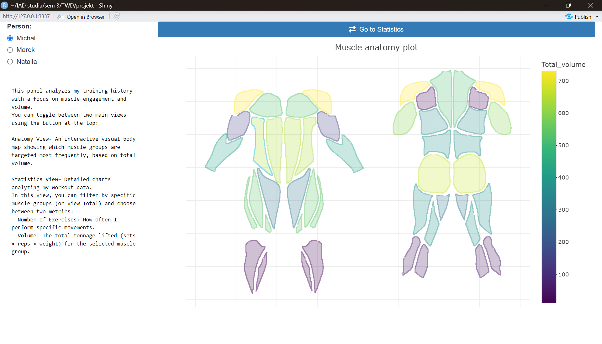
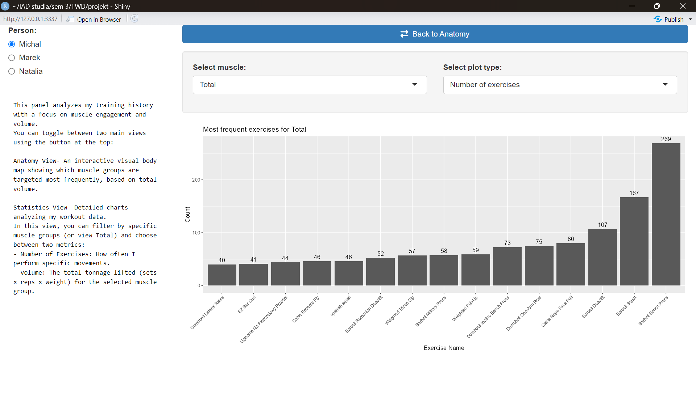
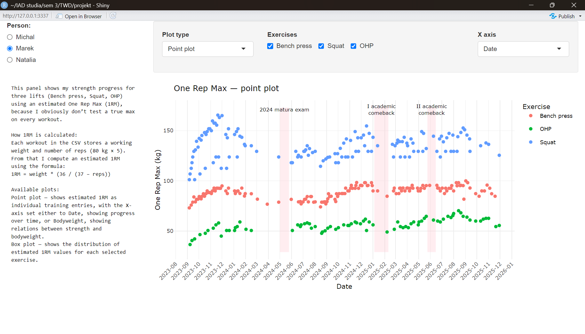
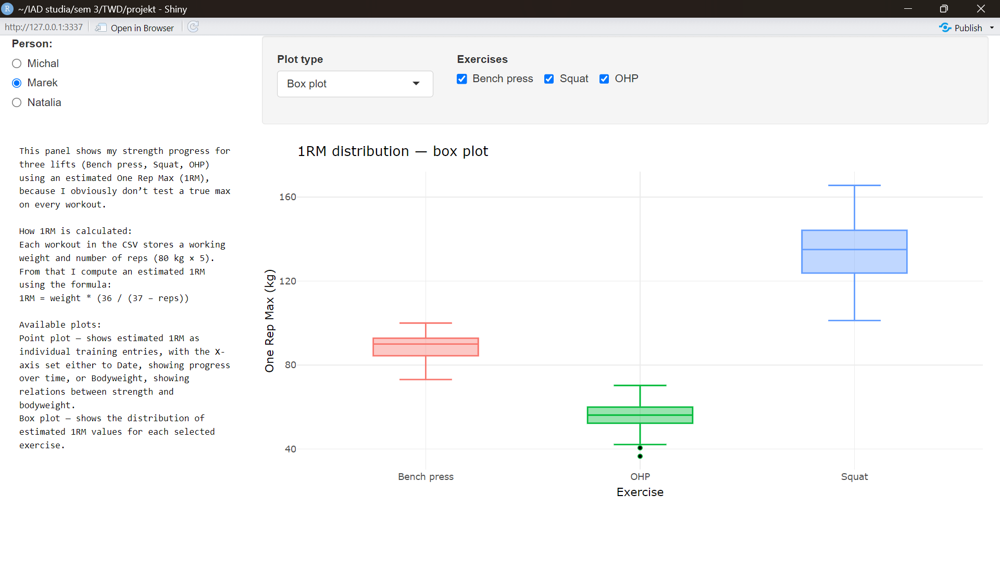
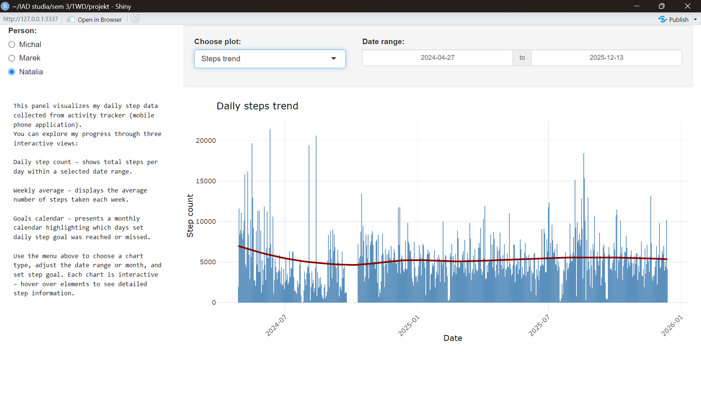
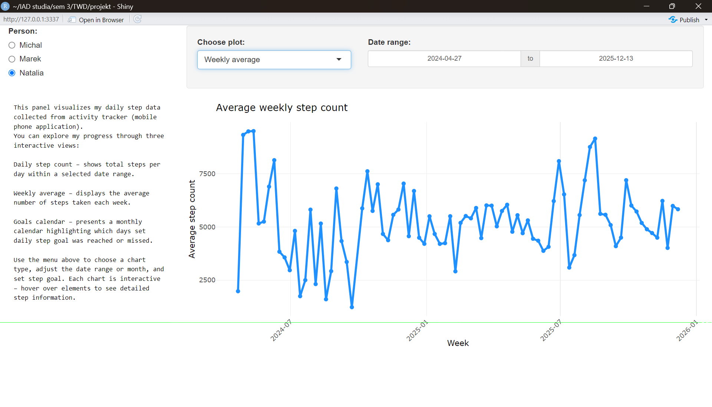
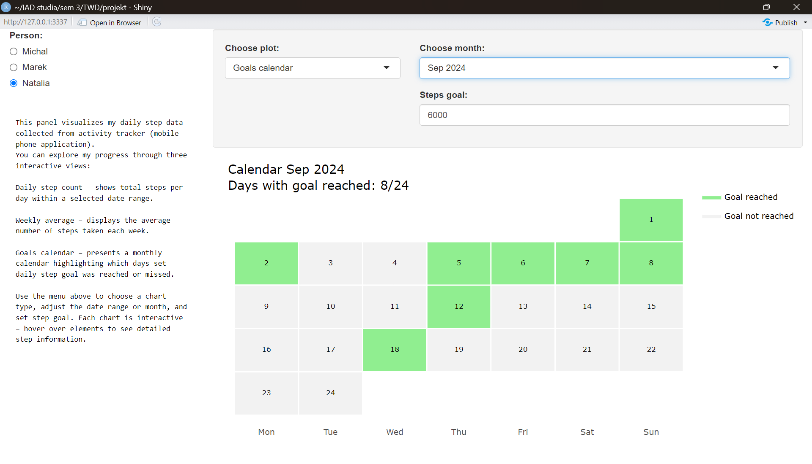

# TWD projekt "JA" 📊

Opis: Aplikacja służy do analizy aktywności fizycznej z wykorzystaniem aplikacji Shiny.

## 1. Przegląd Ogólny
Aplikacja posiada intuicyjny interfejs oparty na panelu bocznym. W lewym górnym rogu użytkownik wybiera, którą wizualizację (imię członka grupy) chce wyświetlić, co dynamicznie zmienia zawartość głównego ekranu.

---

## 2. Michał – Analiza Obciążeń Mięśni

### Wykres 1: Mapa mięśni
* **Opis:** Interaktywna mapa anatomii, pokazująca, która grupa mięśni najczęściej była ćwiczona.
* **Funkcje Interaktywne:** Tooltipy po najechaniu kursorem na mięsień pokazują nazwę mięśnia i dokładny sumaryczny tonaż wykonanych ćwiczeń.

### Wykres 2: Liczba i obciążenie (Bar Plot)
* **Opis:** Wykres pokazujący, jakie grupy mięśni były najczęściej ćwiczone wg liczby ćwiczeń i całkowitego tonażu. 
* **Funkcje Interaktywne:** Wybór przez użytkownika konkretnego mięśnia i przełączanie między wykresem liczby wykonanych ćwiczeń a wykresem całkowitego tonażu.

---

## 3. Marek – Progres szacowanego ciężaru maksymalnego w wyciskaniu leżąc, przysiadzie i OHP 

### Wykres 1: Poszczególne recordy treningowe (Point Chart)
* **Opis:** Wykres przedstawia szacowany ciężar maksymalny (1RM) jako poszczególne wpisy treningowe.
* **Funkcje Interaktywne:** Możliwość zaznaczenia, które ćwiczenia wyświetlić na wykresie; przełączanie na wykres progresu według daty i progresu względem wagi ciała.

### Wykres 2: Statystycznego rozkładu siły w poszczególnych ćwiczeniach (Box plot)
* **Opis:** Wizualizacja pokazująca rozkład wartości szacowanego 1RM dla każdego z wybranych ćwiczeń.
* **Funkcje Interaktywne:** Możliwość zaznaczenia, które ćwiczenia wyświetlić na wykresie.

---

## 4. Natalia – Analiza dziennej liczby kroków

### Wykres 1: Dzienny licznik kroków (Wykres kolumnowy)
* **Opis:** Wykres przedstawiający całkowitą liczbę kroków każdego dnia.
* **Funkcje Interaktywne:** Wybór zakresu dat; tooltipy z dokładną liczbą kroków danego dnia.

### Wykres 2: Średnie tygodniowe
* **Opis:** Wykres przedstawia średnią liczbę kroków z całego tygodnia.
* **Funkcje Interaktywne:** Wybór zakresu dat; tooltipy ze średnią liczbą kroków w danym tygodniu.

### Wykres 3: Kalendarz celów
* **Opis:** Kalendarz przedstawiający, czy dzienny cel kroków został osiągnięty.
* **Funkcje Interaktywne:** Wybór miesiąca do wyświetlenia w kalendarzu; wybór celu kroków; tooltipy z dokładną liczbą kroków danego dnia.
