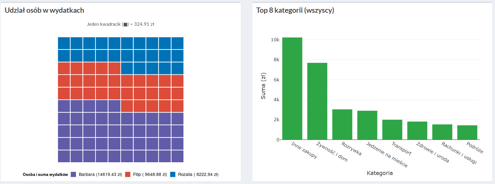
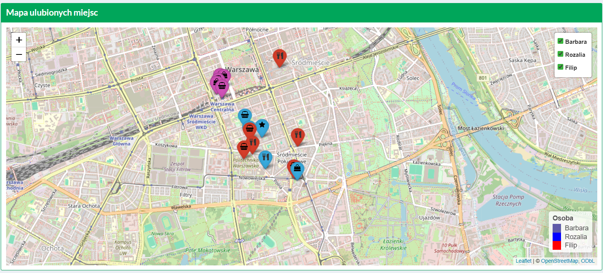
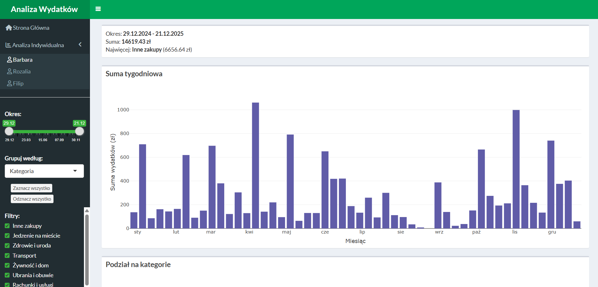
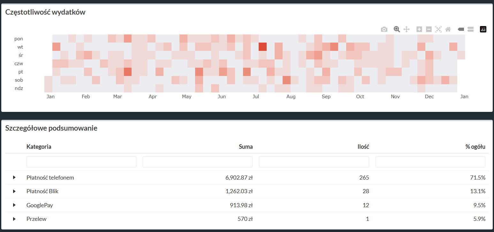
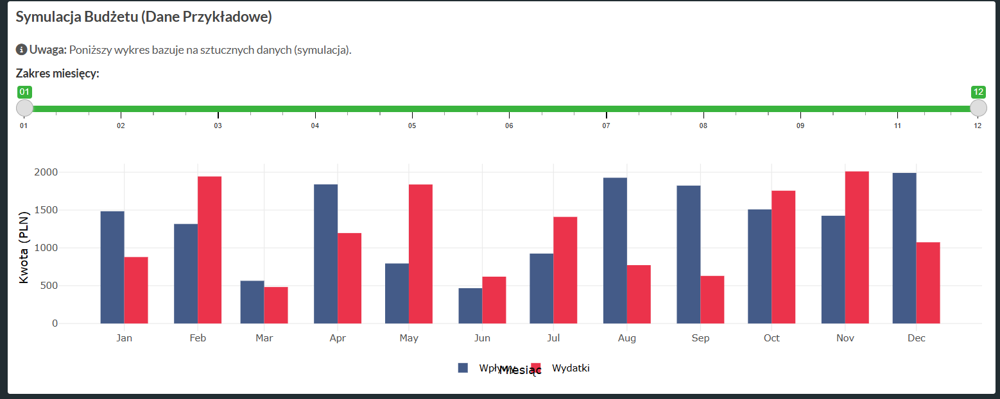

# Projekt JA

## Analiza danych bankowych

Autorzy:

-   Barbara Kozłowska

-   Filip Łabuś

-   Rozalia Wróblewska

Link do aplikacji:
[Aplikacja](https://wroro.shinyapps.io/24_01)

## Aplikacja

### Informacje ogólne

Aplikacja służy do analizy danych bankowych jej autorów. Analizowane dane obejmują cały 2025 rok. Dane są automatycznie przetwarzane z plików bankowych, co pozwala na bieżący wgląd w strukturę wydatków i bardziej świadome planowanie wydatków. Aplikacja została napisana w języku R przy użyciu pakietu Shiny. Wykresy zostały wykonane przy użyciu pakietów PlotLy oraz ggplot, natomiast mapa przy użyciu pakietu Leaflet. Do przetwarzania danych użyto m. in. dplyr oraz stringr.

### Strona główna

Strona główna zawiera podstawowe informacje o projekcie i jego celu. Znajdują się tu również następujące wykresy:

-   Zsumowane wydatki w podziale na kategorie

-   Zsumowane wydatki w podziale na osobę

-   Mapa miejsc, gdzie najczęściej wydajemy pieniądze

### Profile osób

Strony zawierają wizualizacje indywidualne dla każdej osoby. Każdej osobie jest przyjdzielony charakterystyczny kolor. W tym dziale znajdziemy wizualizacje takie jak:

-   Suma wydatków dla danej osoby w podziale na tygodnie

-   Suma wydatków z podziałem na kategorię/rodzaj płatności

-   Częstotliwość wydatków w każdym dniu 2025 roku

-   Tabela ze szczegółowym podsumowaniem wydatków

-   Wykres porównujący wpływy i wydatki (do wizualizacji zostały użyte sztuczne dane ze względu na prywatność)

Na panelu bocznym można dostosować dane do generowania wykresu np. wybór przedziału dat czy wybór kategorii.

