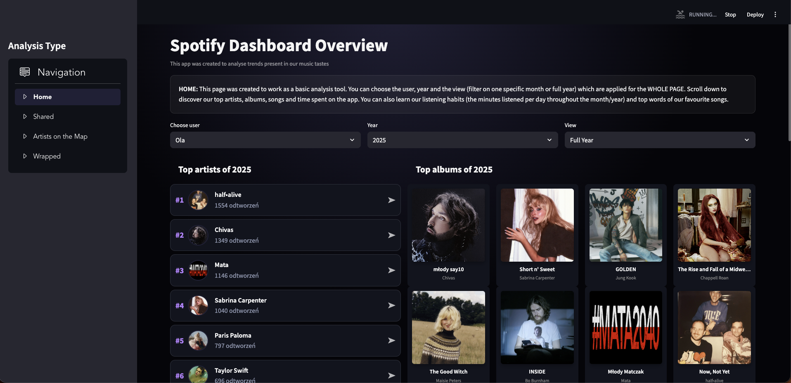
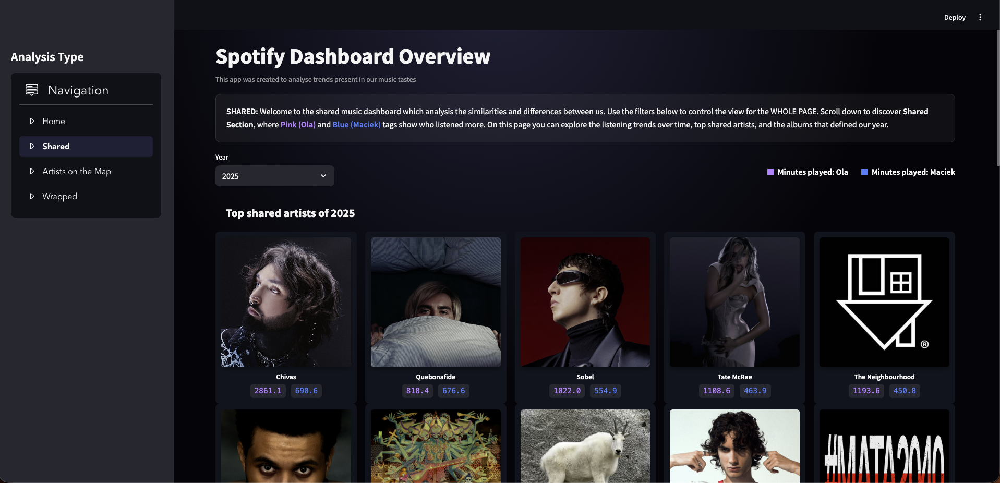
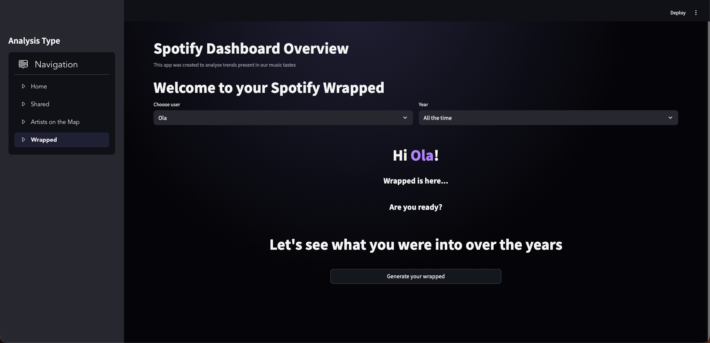

# Spotify_Dashboard
Aplikacja stworzona do analizy trendów widocznych w naszych gustach muzycznych, a również do porównywania naszych nawyków słuchania, odkrywania ulubionych artystów i utworów oraz obserwowania, jak nasz gust muzyczny zmieniał się na przestrzeni lat. Wideo: https://drive.google.com/drive/folders/17ic0J9h14N_i1OtHj4rZFq0eiEO-OiRs?usp=share_link.

Zobacz aplikację w pełnej okazalłości: 
[Aplikacja](https://spotify--dashboard.streamlit.app)
### HOME:

Ta strona została stworzona jako podstawowe narzędzie analityczne. Możesz wybrać użytkownika, rok oraz widok (filtrowanie według konkretnego miesiąca lub całego roku), które mają zastosowanie dla CAŁEJ STRONY. Przewiń w dół, aby odkryć naszych najpopularniejszych artystów, albumy, utwory oraz czas spędzony w aplikacji. Możesz także poznać nasze nawyki słuchania (liczbę minut odsłuchiwania dziennie w ciągu miesiąca/roku) oraz najczęściej występujące słowa w naszych ulubionych piosenkach.

### SHARED:

Witamy na wspólnym panelu muzycznym, który analizuje podobieństwa i różnice między nami. Skorzystaj z poniższych filtrów, aby sterować widokiem dla CAŁEJ STRONY. Przewiń w dół, aby odkryć sekcję Shared, w której różowe (Ola) i niebieskie (Maciek) oznaczenia pokazują, kto słuchał więcej. Na tej stronie możesz także prześledzić trendy słuchania w czasie, najczęściej wspólnie słuchanych artystów oraz albumy, które zdefiniowały nasz rok.

### ARTISTS ON THE MAP:

Odkryj globalny zasięg naszego gustu muzycznego. Możesz korzystać z interaktywnej mapy, aby sprawdzić, skąd pochodzą nasi ulubieni artyści, oraz filtrować wyniki według kontynentu i użytkownika, analizując wkład poszczególnych krajów w obrębie każdego kontynentu. Następnie możesz wybrać konkretne kraje, aby zobaczyć lokalne trendy popularności oraz najpopularniejszych artystów z danego regionu.

### WRAPPED:

To nasze wspólne muzyczne podsumowanie w pigułce. Sekcja Wrapped opowiada historię naszych muzycznych wyborów — ile czasu spędziliśmy ze Spotify, którzy artyści i utwory towarzyszyli nam najczęściej oraz jak nasz gust muzyczny zmieniał się na przestrzeni lat. Krok po kroku odkrywamy nasze najważniejsze statystyki, ulubione kawałki i artystów, a także kraje, z których pochodziła muzyka, której słuchaliśmy najwięcej.

