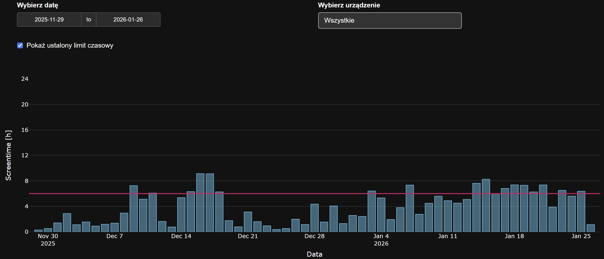
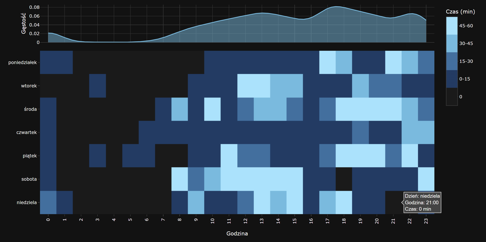
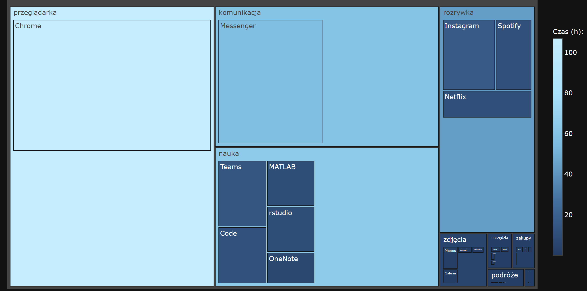
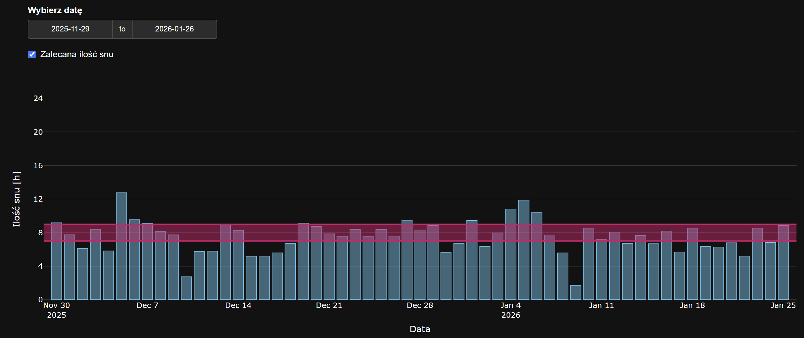

# Screentime

Aplikacja R Shiny App została stworzona na potrzeby projektu na przedmiot Techniki Wizualizacji Danych odbywających się na wydziale Matematyki i Nauk Informacyjnych Politechniki Warszawskiej.  

Aplikacja przedstawia wyniki analizy danych dotyczących naszego czasu spędzonego przed ekranem w formie czterech wykresów:
- Czas spędzony przed ekranem w zależności od dnia.

-   Czas spędzony przed ekranem w wybranym tygodniu w zależności od godziny. Liczona jest, także łączna oraz średnia liczba godzin spędzonych przed ekranem.

-   Najczęściej używane aplikacje z podziałem na kategorie, ukazujące udział procentowy aplikacji oraz kategorii według spędzonego czasu (ukazane za pomocą skali kolorystycznej oraz wielkości kafelków w treemap).

-   Czas snu oszacowany na podstawie ostatniej aktywności telefonu oraz ostatniego porannego budzika. Podane są również informacje o średnim i maksymalnym czasie wstawania.

## Autorki

-   Karolina Nieciecka
-   Anna Garbacz
-   Nina Onyszczuk

## Źródło danych

Dane zostały uzyskane za pomocą aplikacji [ActivityWatch](https://activitywatch.net) w okresie: - 29.11.2025 - 26.01.2026 dla telefonów, - 08.12.2025 - 26.01.2026 dla komputerów.

## Biblioteki

-   shiny
-   jsonlite
-   dplyr
-   tidyr
-   tibble
-   plotly
-   lubridate
-   hms
-   fontawesome
-   treemapify

## Wnioski

-   Niektóre autorki (bez wskazywania palcami) powinni ograniczyć screentime. :)
-   Głównie swój czas przed ekranem spędzałyśmy na przeglądarkach, ucząc się i programując w rstudio, MATLAB oraz korzystając z komunikatorów głównie Messengera.
-   Można też zauważyć, że nie zawsze wstawało nam się łatwo i potrzebowałyśmy na to trochę czasu.
