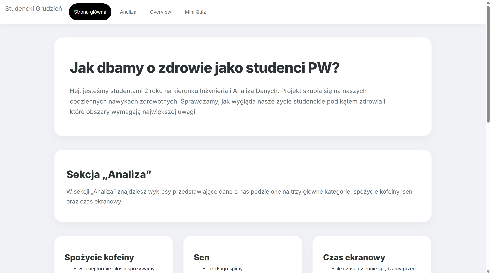

## Techniki wizualizacji danych - projekt 2 - "Studencki grudzień"
### temat: "JA" - analiza danych o naszym trybie życia w grudniu 2025 roku
---
**Autorzy:**
- Emilia Olszewska - nr albumu 339010
- Kacper Piotrowski - nr albumu 339014
- Bartosz Ponieważ - nr albumu 339016

# Dane analizowane w aplikacji

Aplikacja analizuje dane dotyczące naszego trybu życia w grudniu 2025 roku. Dane są podzielone na trzy główne obszary: czas ekranowy i powiadomienia, sen, spożycie kofeiny (także w postaci teiny).

1) **Czas ekranowy i powiadomienia**

        Dane zawierają m.in.:

        - datę,
        - nazwę aplikacji
        - czas spędzony w danej aplikacji
        - powiadomienia otrzymane z danej aplikacji.

2) **Sen**

        Dane zawierają m.in.:

        - datę,
        - liczbę godzin snu,
        - godzinę zaśnięcia i godzinę pobudki

3) **Kofeina**

        Dane zawierają m.in.:

        - datę,
        - ilość spożytych napoi,
        - godzinę spożycia,
        - rodzaj i typ napoju.  

# Nawigacja po aplikacji

Aplikacja ma 4 główne strony:

### 1) **Strona główna**

Na niej znajdują się ogóle informacje dotyczące projektu. Zawiera ona odnośnik "rozpocznij analizę" do sekcji analizy oraz "poznaj twórców projektu" do sekcji overview.

picture 1 : widok strony głównej

picture 2 : widok strony głównej i przejście do analizy (przycisk "rozpocznij analizę") oraz przejście do overview (przycisk "poznaj twórców projektu")

---
### 2) **Analiza**

Główna część analityczna: po lewej stronie jest panel filtrowania danych po osobach. Pod sekcjami są zakładki tematyczne: Spożycie kofeiny, Sen, Czas ekranowy, każda z których wyświetla odpowiednie wykresy. Zakres dat wybieramy poprzez zaznaczenie dowolnego przedziału lub wyborze jednego dnia na kalendarzu.

picture 3 : widok zakładek na stronie analizy i kalendarza do selekcji zakresu dat

picture 4 : widok filtrów na osobe na stronie analizy

---
### 3) **Overview**

Strona podsumowań: „karty analityczne” dla wybranych osób zawierające agregujące metryki z trzech obszarów (czas ekranowy/powiadomienia/sen/kofeina).

    Metryki takie jak:
        - średnia ilość snu, czasu ekranowego, powiadomień, spożytej kofeiny na dobę
        - dni kiedy średnio najmniej snu/ najwięcej kofeiny
        - dni kiedy średnio najwięcej czasu ekranowego i aplikację która zajęła go najwięcej (dzień no-life i top apka)
        - godziny pobudki
        - złodzieji uwagi (aplikacje z najwyższym stosunkiem czasu do powiadomień)

 

picture 5 : widok strony overview z wybranymi kartami analitycznymi oraz widocznym przyciskiem "Pokaż wszystkich"

---

### 4) **Mini Quiz**

Zakładka quizu oparta o shinyquiz – UI quizu jest osadzony w kafelku („TEST WIEDZY O NAS”). Pytania dotyczą przedstawionych w aplikacji danych o autorach projektu.

picture 6 : widok strony quizu

picture 7 : widok strony quizu po udzieleniu odpowiedzi

picture 8 : widok strony quizu po wygraniu - widać konfetti

# Jak wizualizujemy dane?

1) **Kategoria: Spożycie kofeiny**

- Średnie dzienne spożycie napojów (wykres słupkowy; agregacja po dniach / osobach; agregacja po rodzaju napoju w przypadku wyboru jednej osoby).

    
    picture 9 : widok wykresu spożycia napojów i podsumowania kofeiny dla więcej niż jednej osoby

    
    picture 10 : widok wykresu spożycia napojów i podsumowania kofeiny dla jednej osoby

- Rozkład spożycia kofeiny w ciągu dnia (wykres gęstości po godzinie). Dla wielu osób – rozkład per osoba; dla jednej osoby – rozbicie po typie napoju.

    
    picture 11 : widok wykresu rozkładu spożycia kofeiny w ciągu dnia dla więcej niż jednej osoby i podsumowanie rytmu dnia według typu pitego napoju

    
    picture 12 : widok wykresu rozkładu spożycia kofeiny w ciągu dnia dla jednej osoby i podsumowanie rytmu dnia według typu pitego napoju

---

2) **Kategoria: Sen**

- Ilość snu na dzień: wykres słupkowy godzin snu od dnia.
    
    picture 13 : widok wykresu ilości snu na dzień i podsumowanie danych o śnie

- Histogramy godzin zasypiania i wstawania.
    
    picture 14 : widok histogramów godzin zasypiania i wstawania

- Radar plot godziny zasypiania od dnia tygodnia (dla jednego dnia - tabela porównująca czas snu w danym dniu ze średnią długością snu w miesiącu).
    
    picture 15 : widok radar plotu godziny zasypiania od dnia tygodnia gdy w zakresie dat jest więcej niż jeden dzień

    
    picture 16 : widok tabelki porównującej czas snu w danym dniu ze średnią długością snu w miesiącu gdy w zakresie dat jest jeden dzień

--- 

3) **Kategoria: Czas ekranowy**

- Czas przed ekranem w godzinach - wykres liniowy lub słupkowy (w przypadku wybrania jednego dnia agregacja po rodzaju aplikacji). Oraz podsumowanie danych o czasie ekranowym.
    
    picture 17 : widok wykresu czasu ekranowego dla więcej niż jednego dnia i podsumowanie danych o czasie ekranowym

    
    picture 18 : widok wykresu czasu ekranowego dla jednego dnia z pokazem top 15 najbardziej używanych aplikacji i podsumowanie danych o czasie ekranowym

- Powiadomienia: - wykres liniowy lub słupkowy (mechanizm analogiczny do wykresu powyżej). Oraz podsumowanie danych o powiadomieniach.
    
    picture 19 : widok wykresu powiadomień dla więcej niż jednego dnia i podsumowanie danych o powiadomieniach

    
    picture 20 : widok wykresu powiadomień dla jednego dnia i podsumowanie danych o powiadomieniach

- Najwięcej używane aplikacje i aplikacje wysyłające najwięcej powiadomień - chmury słów.
    
    picture 21 : widok chmury słów z pokazem najwięcej używanych aplikacji i aplikacji wysyłających najwięcej powiadomień

- Zależność między czasem ekranowym a ilością powiadomień (przy jednym dniu: punkt to aplikacja, osobno dla osoby; przy zakresie: punkt to dzień (agregacja dzienna), z linią trendu).
    
    picture 22 : widok zależności między czasem ekranowym a ilością powiadomień dla więcej niż jednego dnia

    
    picture 23 : widok zależności między czasem ekranowym a ilością powiadomień dla jednego dnia per aplikacja

- Wskaźnik zaangażowania (minuty na 1 powiadomienie) - ranking aplikacji o najwyższym stosunku czasu do powiadomień przedstawiony na wykresie słupkowym.
    
    picture 24 : widok wskaźnika zaangażowania (minuty na 1 powiadomienie) - ranking aplikacji o najwyższym stosunku czasu do powiadomień przedstawiony na wykresie słupkowym

- Radar plot czas ekranowego od dnia tygodnia (mechanizm taki sam jak przy radar plocie godziny zasypiania od czasu).
    
    picture 25 : widok radar plotu czas ekranowego od dnia tygodnia gdy wybrany jest więcej niż jeden dzień

    
    picture 26 : widok tabelki porównującej czas ekranowy danego dnia z średnią wartościami w miesiącu gdy wybrany jest jeden dzień

