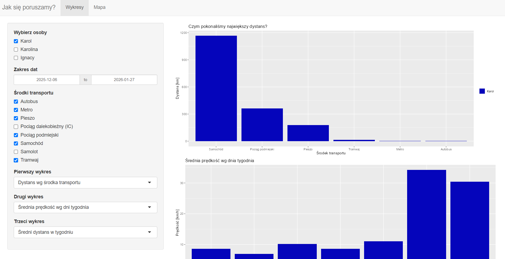
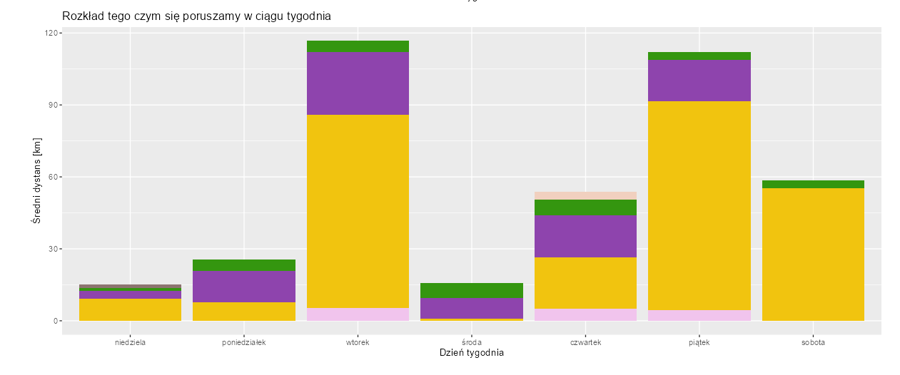
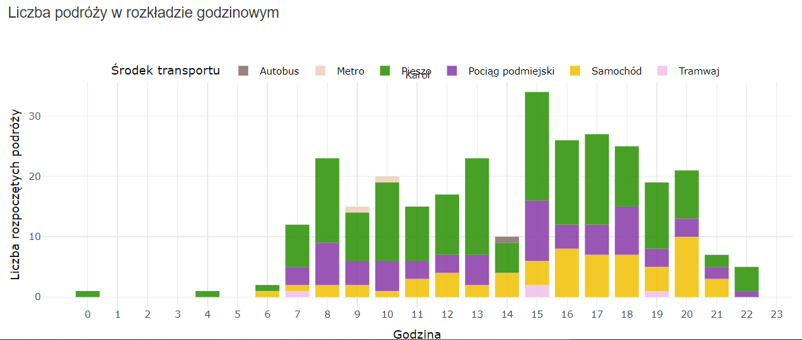
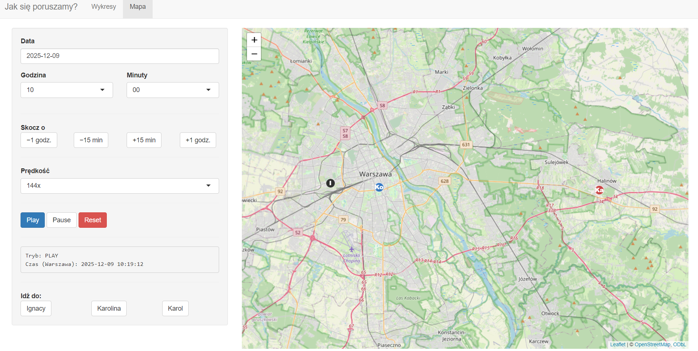

# Projekt JA - *Jak się przemieszczamy?*

  

## Autorzy:

Ignacy Stępniewski

Karol Siembida

Karolina Strzelecka

  

## Wstęp

Aplikacja służy do analizy danych z osi czasu z Google Maps.

Dane wyeksportowane z osi czasu do .json i przetwarzane w aplikacji. Obejmują one okres od grudnia do stycznia.

Aplikacja została napisana w języku R przy użyciu pakietu Shiny. *biblioteki?*

## Pierwsza Strona:

Wykresy słupkowe na pierwszej stronie pozwalają porównać jak często każdy z nas poruszał się wybranym środkiem transportu oraz jaką część naszych podróży stanowiły odpowiednie środki transportu. Podział na dni pozwala też na odczytanie tego, jaki wpływ na to czym jeździmy mają nasze studia na uczelni.

Ostatni wykres dla każdej osoby osobno pokazuje liczbę podróży rozpoczętych danym środkiem transportu w podanych godzinach - dzięki temu pozwala ocenić w jakich godzinach najwięcej się przemieszczamy oraz w jakich proporcjach korzystamy z różnych środków transportu.

## Druga strona:

Na mapce możemy symulować jak przemieszczamy się w wybranym okresie czasu lub gdzie przebywamy, do wyboru mamy także prędkość symulacji, możemy także cofnąć czas o dane wartości oraz skoczyć do lokalizacji wybranej osoby.

