Projekt JA - analiza danych z aplikacji Spotify

Autorzy:
Piotr Świeczewski
Maciej Pastuszka
Yauheni Butsialevich

Opis projektu:
Stworzony przez nas dashboard przedstawia wyniki analizy danych dotyczących słuchanej przez nas muzyki: 

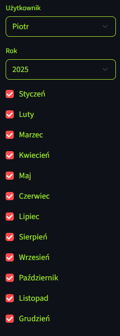
Panel boczny do filtrowania danych względem dat i uzytkownika.

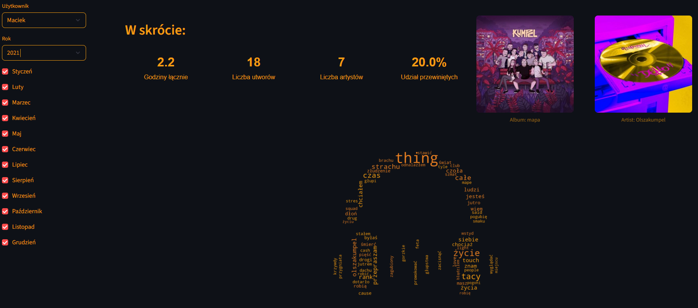
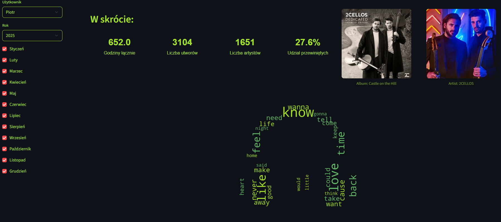

Panele główne (góra strony). Na samej górze podsumowanie zagregowanych informacji - czas słuchania // unikalne utwory // unikalni artyści // skiprate. 
W prawym górnym roku - zdjęcie okładki albumu najpopularniejszego utworu (względem czasu słuchania) oraz zdjęcia profilowego twórcy. 
Poniżej wordcloud tworzony na podstawie piosenek, które były słuchane w danych miesiącach / latach. 
 
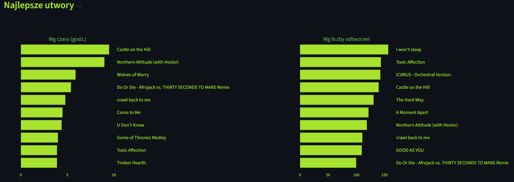
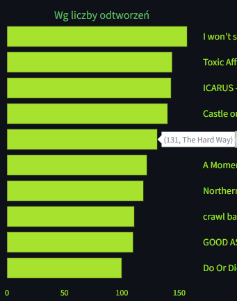
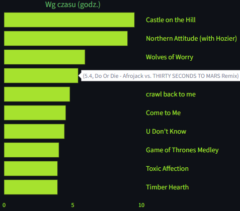
Najczęściej słuchane utwory względem czasu słuchania oraz ilości 
przesłuchań. Wykresy są interaktywne co ułatwia ich czytanie. 

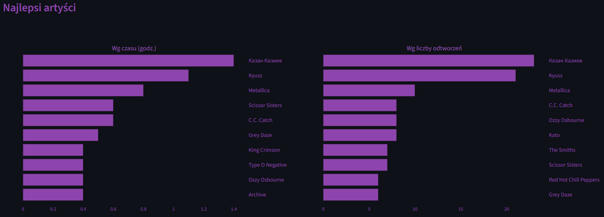
Najczęściej słuchani artyści względem czasu słuchania oraz unikatowych utworów. 

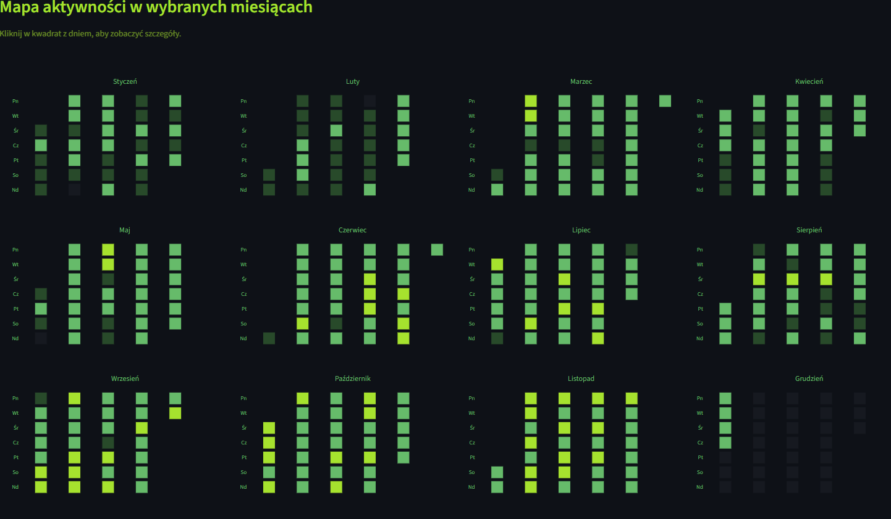
Heatmapa aktywności z danego roku. 

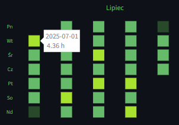
... interaktywność - data + ilość godzin danego dnia. Po kliknięciu w dane pole otwiera się panel przebieg z dnia. 

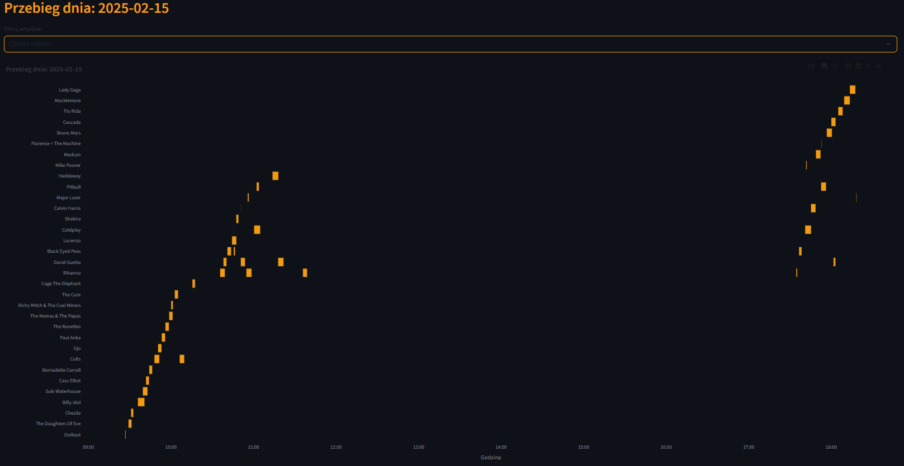
Panel przedstawia szczegółowo co było sluchane danego dnia i o której godzinie. 

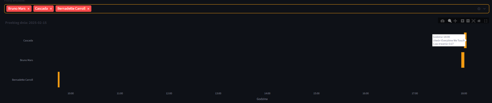
Można wybrać konkretnych artystów. 

Źródło danych 
Spotify Extended History - dane nie są ogólno dostępne, należy wysłać prośbę o ich przygotowanie, są wysyłane w przeciągu ~2 tygodni. 

