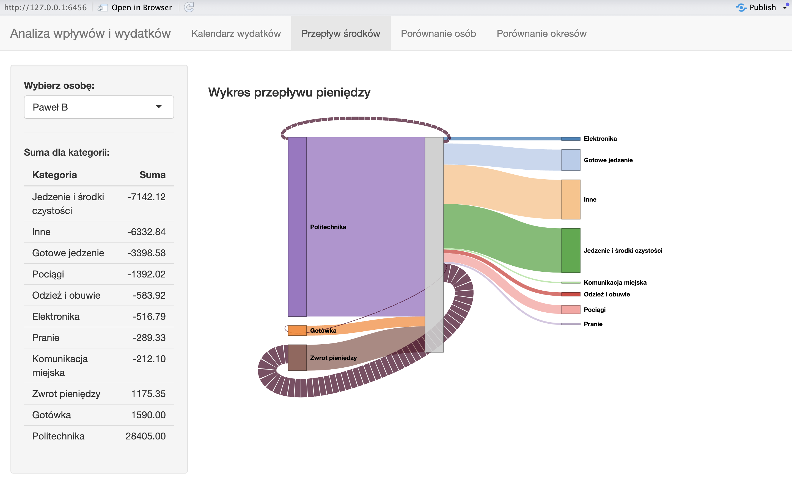
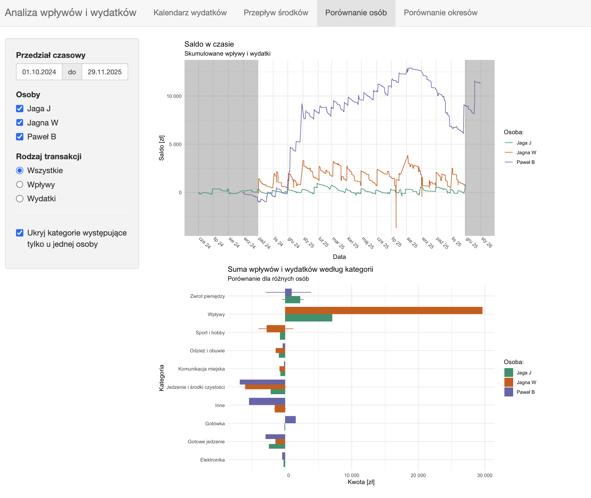
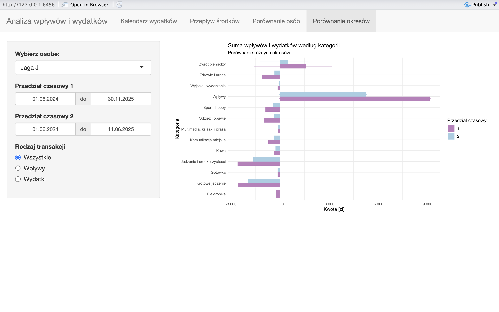

## Analiza Wpływów i Wydatków – R Shiny Dashboard

**Kluczowe funkcjonalności:**
- **Kalendarz wydatków:** Szczegółowa analiza aktywności finansowej w czasie za pomocą heatmap i wykresów słupkowych, pozwalająca dostrzec sezonowość i dzienne nawyki zakupowe.
    
- **Wizualizacja przepływów (Sankey):** Diagram Sankeya obrazujący "drogę" pieniędzy – od źródeł przychodu (np. Wpływy, Zwroty) do konkretnych kategorii wydatków.
    
- **Porównanie osób:** Moduł pozwalający na zestawienie salda i struktury wydatków dla różnych użytkowników (np. domowników).
    
- **Porównanie okresów:** Możliwość zestawienia ze sobą dwóch dowolnych przedziałów czasowych w celu analizy zmian w budżecie.

