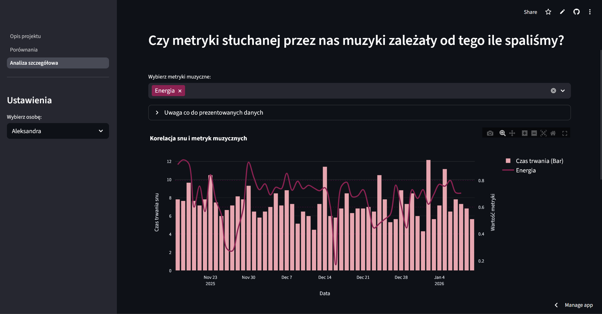
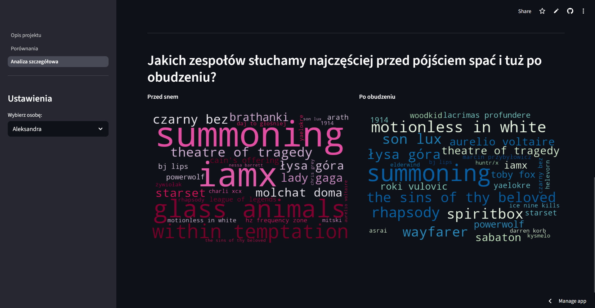
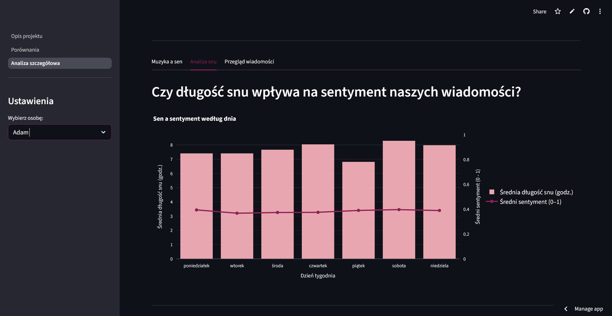
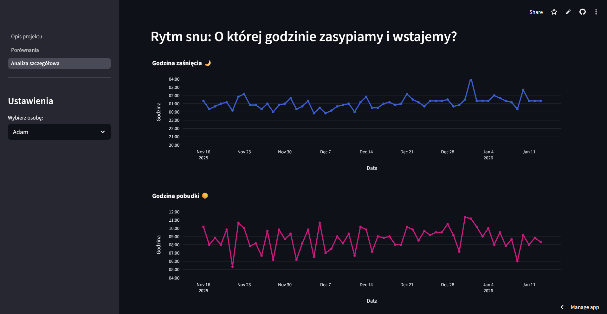
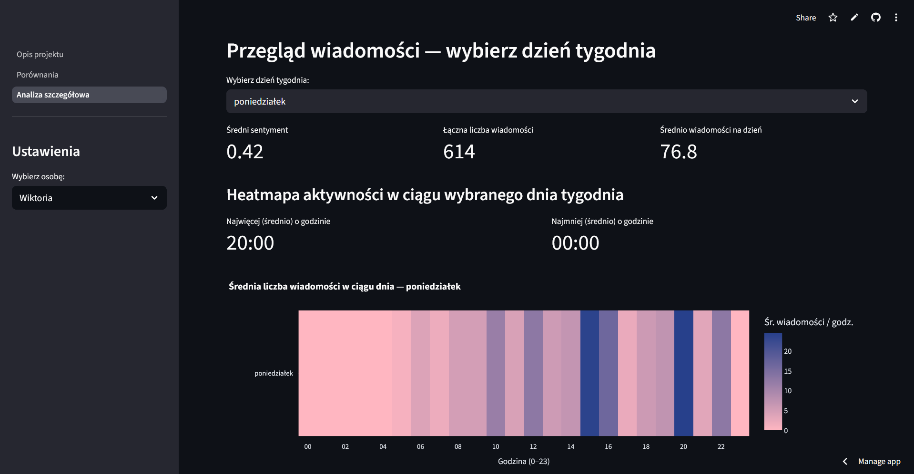
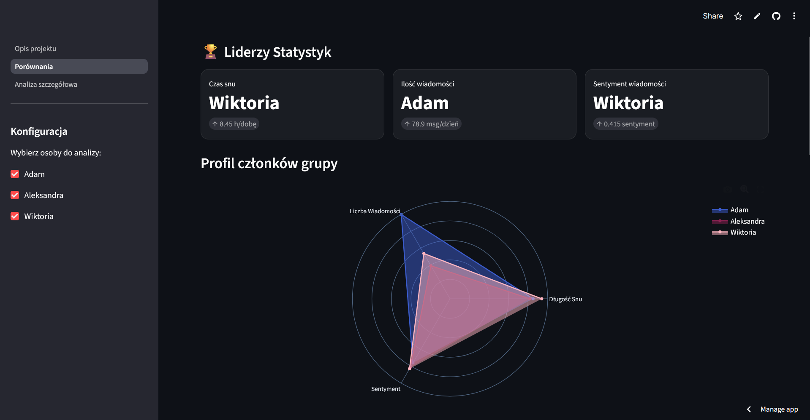

# Sleep, Mood & Messages
Aplikację można obejrzeć tutaj:
[Sleep, Mood & Messages](https://sleep-mood-messages.streamlit.app/Analiza_szczeg%C3%B3%C5%82owa)
## O projekcie
Celem aplikacji jest wizualna analiza tego, jak nasz sen może wiązać się z:
* nastrojem (sentymentem wiadomości),
* aktywnością komunikacji (liczbą wiadomości),
* charakterystyką słuchanej muzyki (np. energia, taneczność).

## Analiza snu i muzyki
W tej części aplikacji skupiliśmy się na tym, aby zobaczyć, czy długość naszego snu wpływa na to, jakiej muzyki słuchamy następnego dnia. Korzystamy ze znanych metryk przygotowanych przez Spotify.

Patrzymy też, które zespoły towarzyszyły nam najczęściej zaraz po przebudzeniu i przed pójściem spać. Dane przestawiają bardzo intuicyjne chmury słów.

## Analiza wiadomości i snu
Sprawdziliśmy też, czy rzeczywiście krótki czas snu sprawa, że następnego dnia jesteśmy markotni i dajemy upust swojemu zmęczeniu w naszych rozmowach. 

W tej sekcji zamieściliśmy też trochę więcej informacji o naszych trendach snu, patrzymy kiedy chodzimy spać i kiedy się budzimy.

## Przegląd wiadomości
Na sam koniec przekonaliśmy się, kto z nas ma najwięcej do powiedzenia i w jakich godzinach dnia. Nocnym filozofem może być każdy. 

## Porównanie
Na tej zakładce zebraliśmy nasze statystyki w jedno miejsce i wytypowaliśmy zwyciezców w każdej kategorii.

## Źródła danych
* Samsung Health - czas snu
* Messenger - wiadomości
* Spotify - historia słuchanej muzyki

## Autorzy
* Bagiński Adam
* Dmitruk Aleksandra
* Postek Wiktoria
