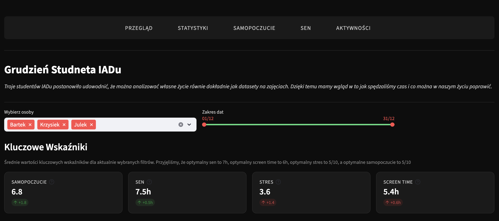
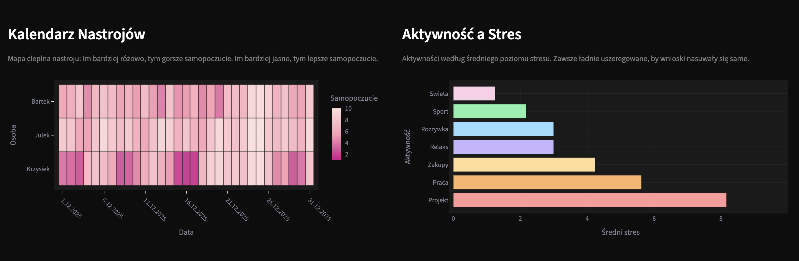
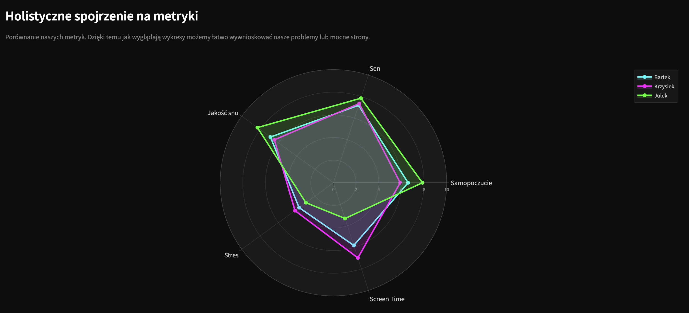
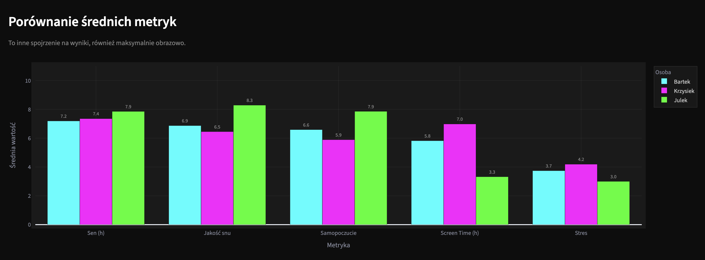
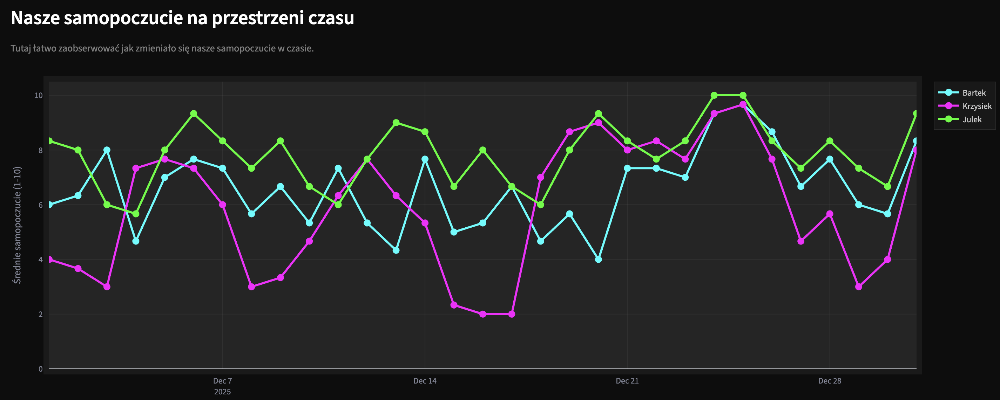
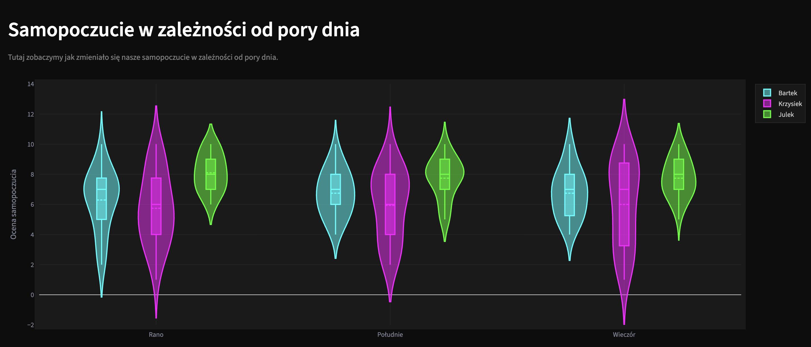
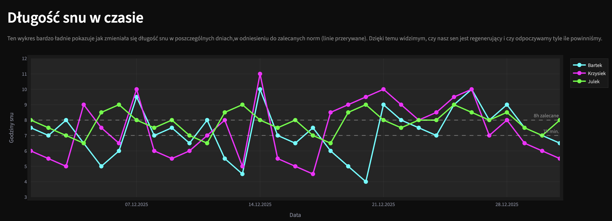
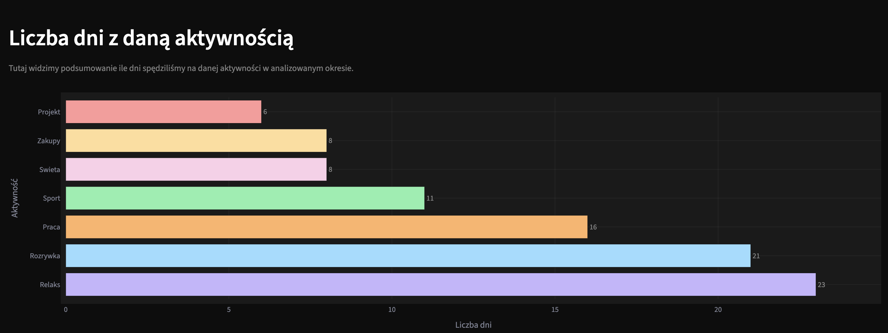

# Grudzien Studenta IADu - Interaktywny Dashboard

> Interaktywny dashboard przedstawiajacy analize zycia codziennego trzech studentow IADu w grudniu 2025.

**[Zobacz aplikacje na zywo](https://monthinlifeofadatascienestudents.streamlit.app/)**

## O Projekcie

Troje studentow IADu postanowilo pokazac ich Day in Life as a Data Science Student. Aplikacja prezentuje wizualizacje:

- **Samopoczucia** w czasie i w zaleznosci od pory dnia
- **Snu** - dlugosc i jakosc w korelacji ze screentime
- **Aktywnosci** i ich wplywu na poziom stresu
- **Screen time** i jego wplywu na nasze zycie

## Zrzuty Ekranu

### Przeglad - Kluczowe Wskazniki

Glowne metryki: samopoczucie, sen, stres, screen time z porownaniem do wartosci optymalnych.

### Przeglad - Kalendarz Nastrojow i Aktywnosci

Heatmapa samopoczucia i wykres korelacji aktywnosc-stres.

### Statystyki - Wykres Radarowy

Holistyczne porownanie wszystkich metryk na wykresie radarowym.

### Statystyki - Porownanie Metryk

Grupowany wykres slupkowy porownujacy srednie metryki dla kazdej osoby.

### Samopoczucie w Czasie

Interaktywny wykres liniowy zmian samopoczucia w ciagu miesiaca.

### Samopoczucie wg Pory Dnia

Wykres skrzypcowy pokazujacy rozklad samopoczucia rano, w poludnie i wieczorem.

### Sen vs Screen Time

Wykres punktowy pokazujacy korelacje miedzy czasem przed ekranem a jakoscia snu.

### Dlugosc Snu w Czasie

Wykres liniowy dlugosci snu z liniami odniesienia dla norm (7h i 8h).

### Rozklad Stresu wg Aktywnosci

Box plot pokazujacy rozklad poziomu stresu dla roznych typow aktywnosci.

### Liczba Dni z Aktywnoscia

Poziomy wykres slupkowy pokazujacy ile dni spedzilismy na poszczegolnych aktywnosciach.

## Autorzy

- Bartlomiej Domanowski
- Krzysztof Rybicki
- Julian Mierzejewski

---

Projekt 2 - Techniki Wizualizacji Danych
