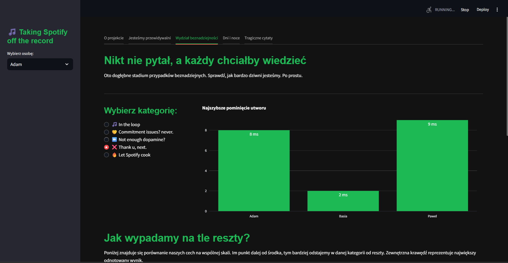
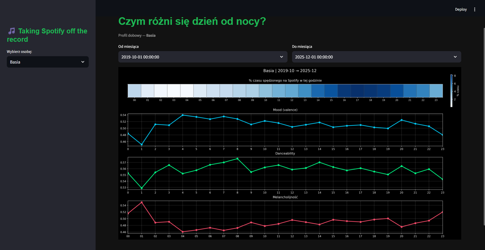
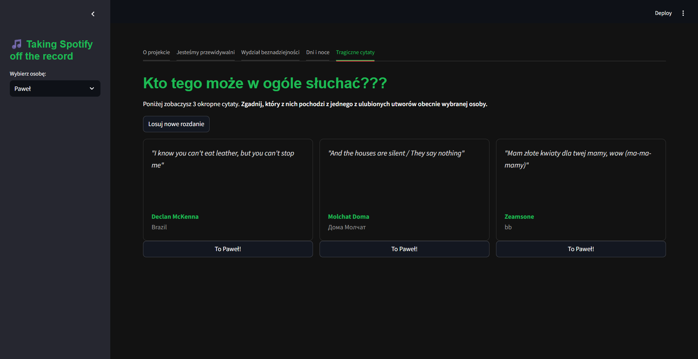

# Taking Spotify off the record
### Adam Drogowski, Barbara Gawlik, Paweł Zakrzewski

*Taking Spotify off the record* to stworzony przez nas dashboard w formie aplikacji webowej, analizujący nasze historie aktywności ze Spotify. Jego celem jest odkrywanie i pokazywanie naszych najgorszych i najdziwniejszych muzycznych nawyków. Aplikacja została stworzona w Streamlit.

## Funkcjonalności

Po uruchomieniu aplikacji, należy z panelu bocznego wybrać osobę, na której chcemy się skupić, przeglądając analizy z dashboardu. Nasza aplikacja składa się z 4 zakładek:

1. **Jesteśmy przewidywalni**
   
Gra, w której użytkownik zgaduje, której z wylosowanych 3 pozycji o danej godzinie najprawdopodobiej słuchałaby wybrana osoba. To, czy odpowiedź jest poprawna, sprawdzamy na podstawie danych historycznych ze Spotify.

2. **Wydział beznadziejności**
   
Analiza naszych najgorszych nawyków, takich jak:
- *In the loop* - jaka jest największa liczba przesłuchań jednej i tej samej piosenki pod rząd,
- *Commitment issues? Never* - ile razy obsesyjnie zapętlaliśmy utwory,
- *Not enough dopamine?* - ile razy pominęliśmy utwór od razu po jego początku,
- *Thank u, next* - najszybsze pominięcie utworu,
- *Let Spotify cook* - jaki procent słuchanych utworów wybieraliśmy ręcznie?

Sekcja ta również zawiera wykresy radarowe, na których porównane są natężenia tych cech pomiędzy nami.

3. **Dni i noce**
   
Heatmapy pokazujące profile dobowej aktywności muzycznej, z podziałem na:
- procent czasu w danej godzinie spędzony na słuchaniu muzyki,
- średni nastrój utworów wg godziny,
- średnie danceability utworów wg godziny,
- średnią melancholię utworów wg godziny.

4. **Tragiczne cytaty**
   
Quiz z najgorszymi cytatami z utworów, których słuchamy najczęściej. Użytkownik zgaduje, który z nich należy do wybranej osoby (znajduje się w tekście jednej z ulubionych piosenek wybranej osoby).

## Kilka zrzutów ekranu

 
 

