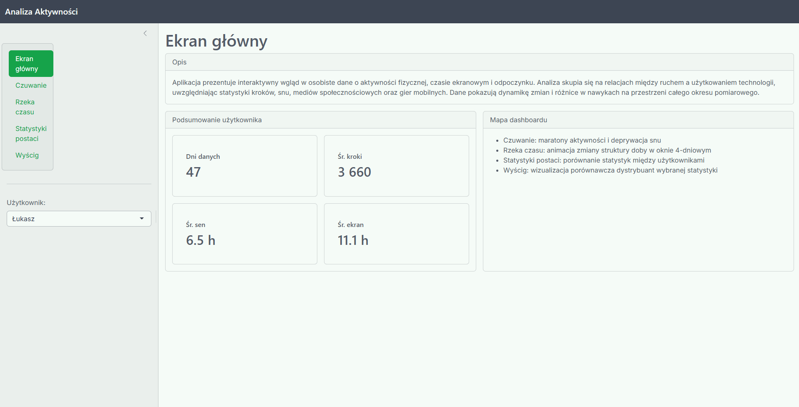

# Analiza Aktywności

Aplikacja służy do wizualizacji i analizy danych dotyczących codziennych aktywności, takich jak kroki, higiena snu oraz czas spędzony przed ekranem (komputer/telefon) na podstawie plików CSV.

---

### Główne Funkcje

* **Czuwanie**
  Wizualizacja czasu rozpoczęcia i zakończenia stanu aktywnego każdego dnia wraz z najdłuższym zarejestrowanym maratonem bez spania.

* **Rzeka Czasu**
  Animacja przedstawiająca szczegółowy rozkład zajęć w ciągu doby.

* **Statystyki postaci**
  Zestawienie kluczowych parametrów każdego użytkownika w formie wykresu radarowego.

* **Wyścig statystyk**
  Porównanie między użytkownikami liczby kroków, czasu spędzonego przed ekranem oraz długości snu.

---

### Interfejs aplikacji

---

### Struktura danych
Aplikacja przetwarza dane dotyczące:
1. Aktywności fizycznej (liczba kroków).
2. Higieny snu (godzina rozpoczęcia, zakończenia oraz czas trwania).
3. Czasu ekranowego (podział na komputer oraz telefon).