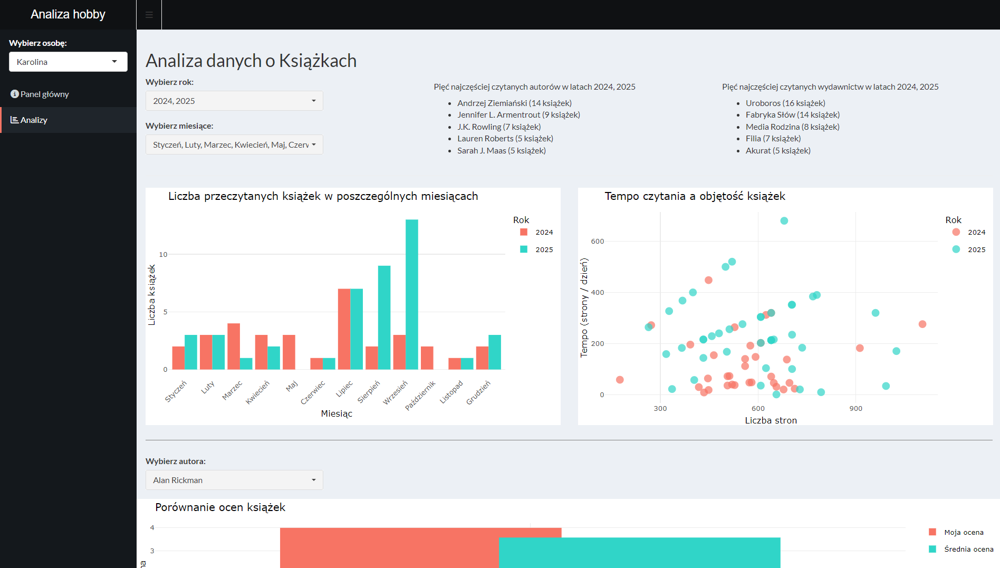
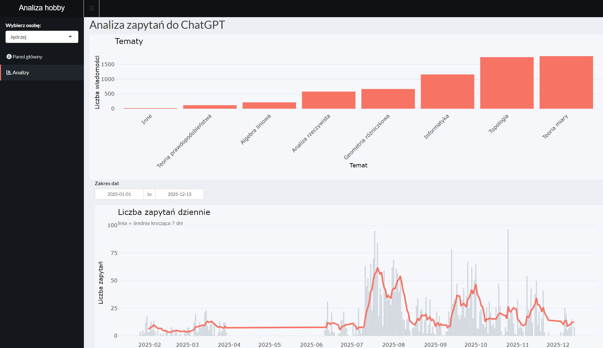
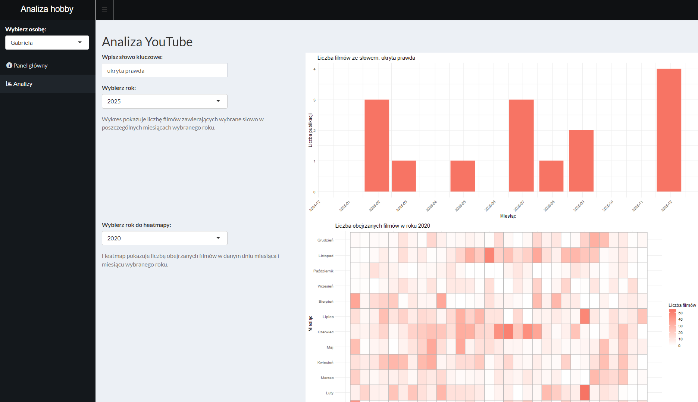

# Analiza hobby

## Opis projektu
Projekt **Analiza hobby** to interaktywna aplikacja do analizy danych związanych z zainteresowaniami użytkowników. Umożliwia m.in.:
- analizę przeczytanych książek (liczba, autorzy, wydawnictwa, tempo czytania),
- analizę zapytań do ChatGPT według tematów i czasu,
- analizę aktywności na YouTube (liczba filmów według słów kluczowych, miesięcy oraz heatmapy aktywności).

Aplikacja pozwala wybierać osobę, zakres dat, lata oraz inne filtry, a wyniki prezentowane są w formie czytelnych wykresów.

## Wideo
🎥 Link do filmiku prezentującego projekt:

[nagranie](https://drive.google.com/file/d/1fckaH81zne_3kVfZlImTTU1qQQoOUvMM/view)

## Zrzuty ekranu

### Analiza danych o książkach

### Analiza zapytań do ChatGPT

### Analiza YouTube

## Autorzy
- Karolina Jagielak
- Jędrzej Kwaśny
- Gabriela Załęska

