# Project JA — Personal Analytics Dashboard

Project JA to streamlitowa aplikacja do ogarniania codziennych rutyn na podstawie kilku źródeł danych naraz. Zbiera w jedno miejsce kroki, czas ekranowy, plan zajęć, pogodę i lokalizacje, a potem pokazuje to w formie wykresów, porównań i drill‑downu pojedynczego dnia. Całość jest filtrowana po osobie i zakresie dat, więc da się szybko sprawdzić, co się dzieje w danym tygodniu albo w konkretnym przedziale.

## Co pokazuje aplikacja

- **Daily Story** — szybki przegląd: KPI, master timeline (screen + kroki + balance + pogoda + zajęcia), pokrycie danych i kompozycja czasu ekranowego.
- **Drivers & Comparisons** — zależności i porównania: scatter z trendem, porównania grup (np. deszcz vs brak) oraz korelacje.
- **Day Drill‑down** — pojedynczy dzień: kalendarz, plan zajęć, kontekst kroków i mapa miejsc.

## Zrzut ekranu aplikacji

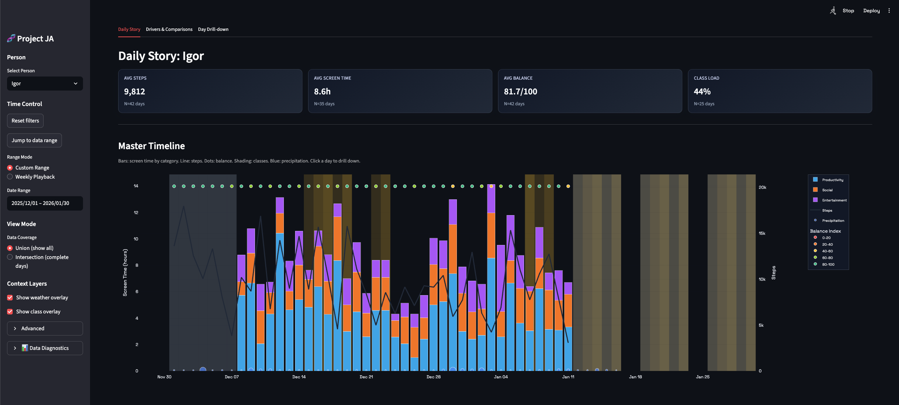

## Zrzuty ekranu

### Daily Story

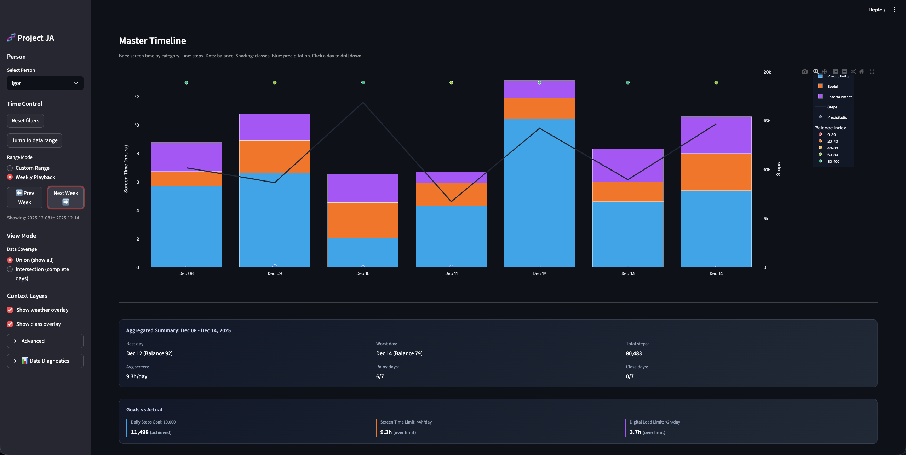

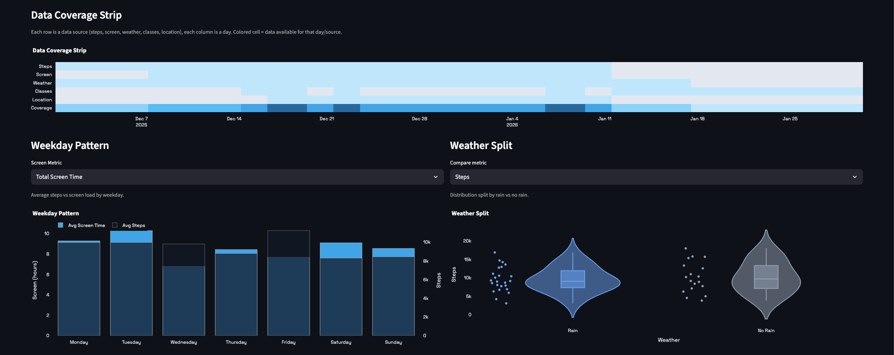

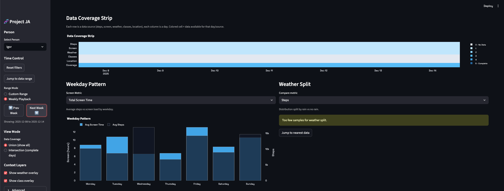

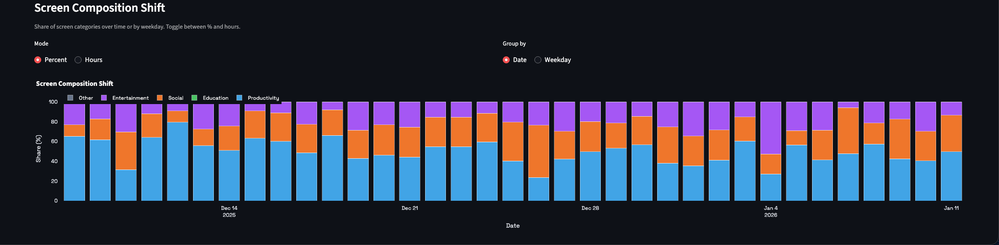

### Drivers & Comparisons

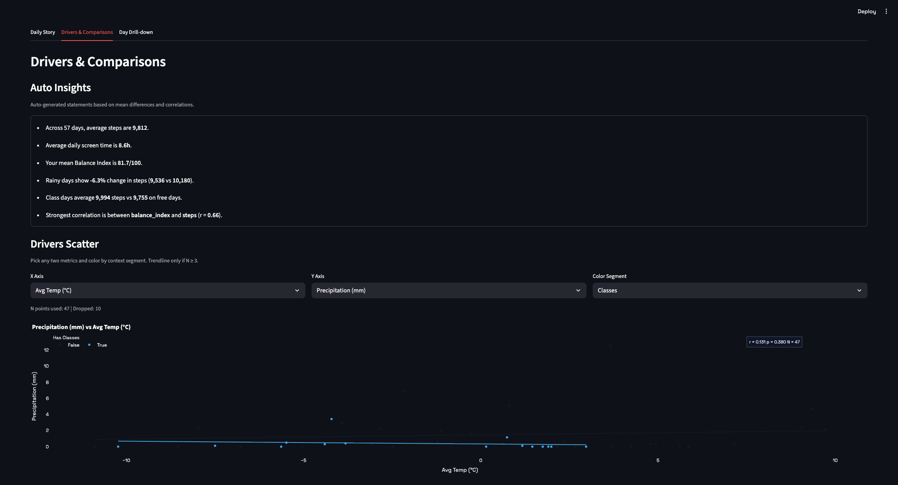

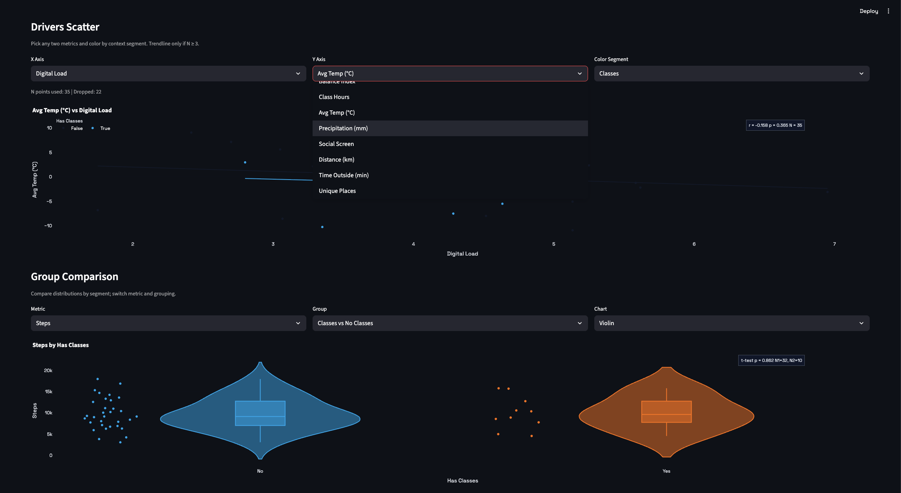

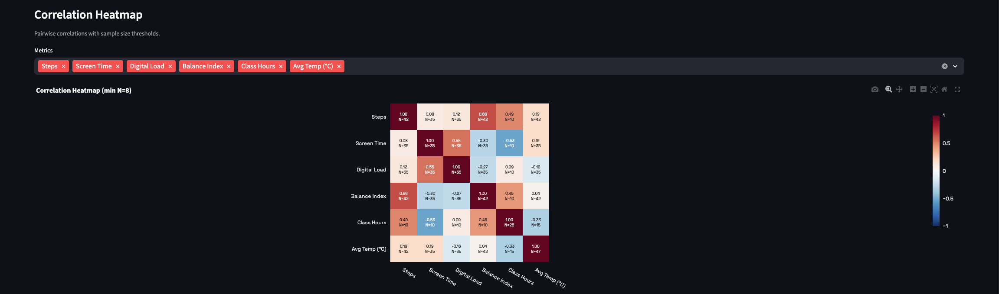

### Day Drill‑down

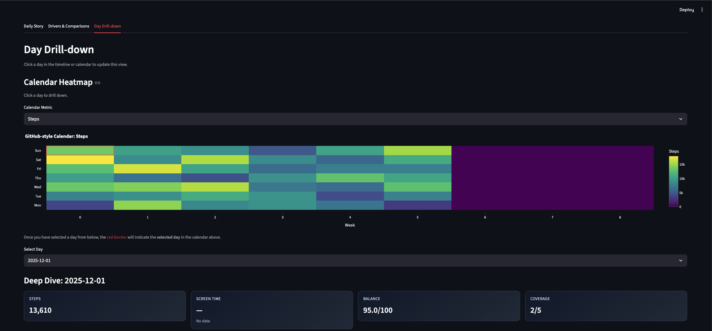

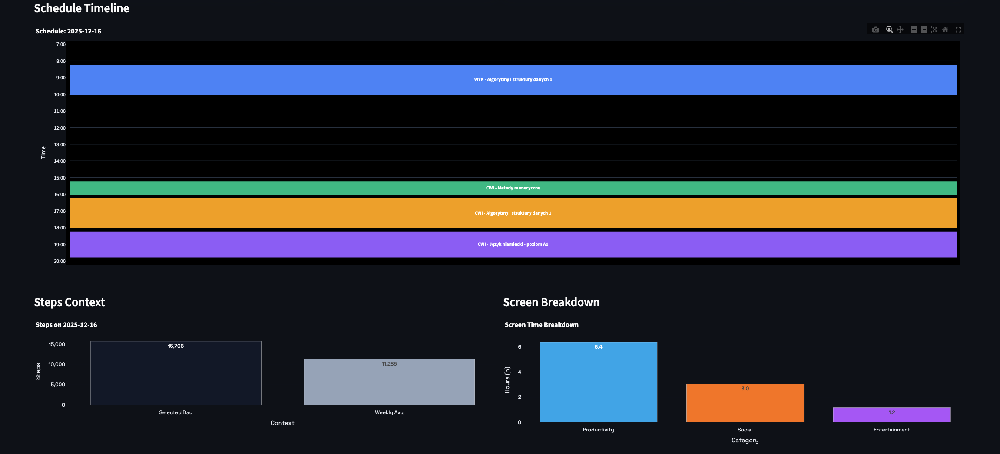

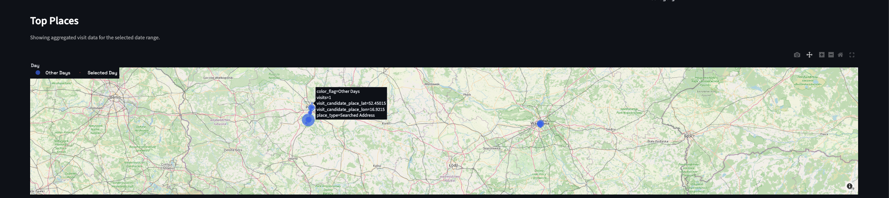
